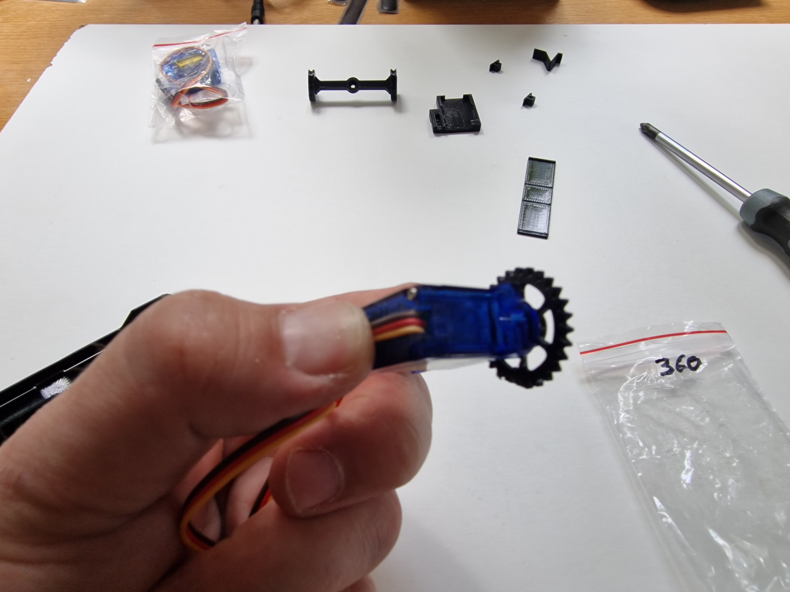
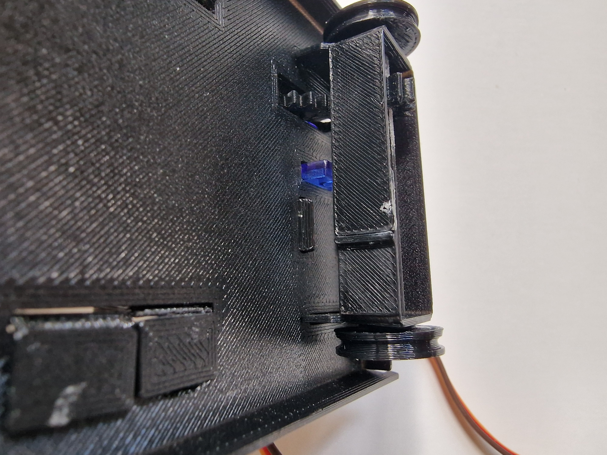
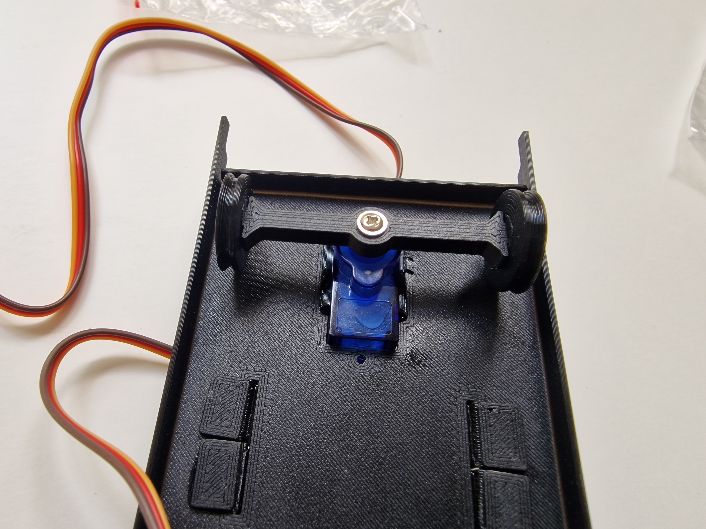
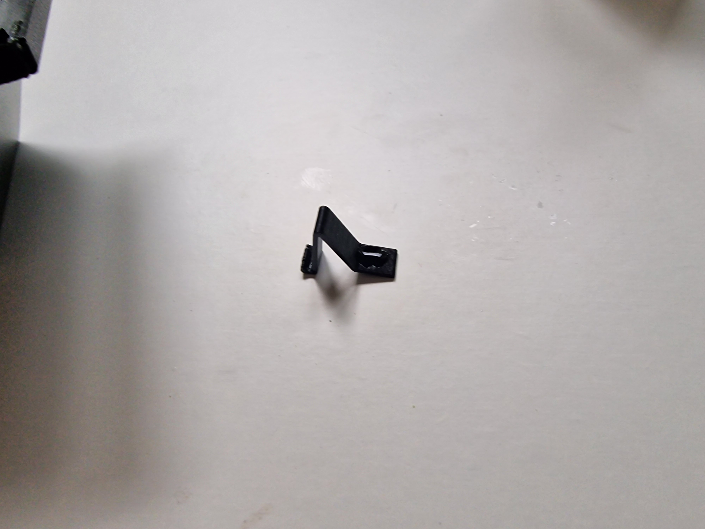
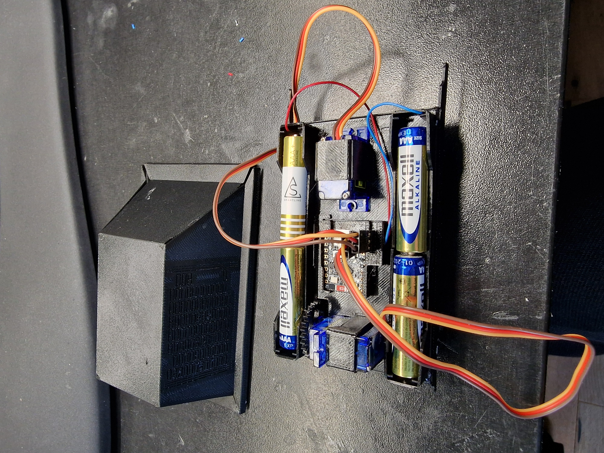

<h1>Instruktioner MicroMouse</h1>

Några tips innan du börjar
<ul>
<li>Plasten är tunn där den ska vikas. Kontrollera gärna 2 gånger åt vilket håll den ska vikas så det blir rätt från början. Viker du fram och tillbaka kommer den gå av.</li>
<li>Limmet vi använder är cyanoakrylat, även kallat superlim eller snabblim.
    <ul>
      <li>Cyanoakrylat är i princip inte farligt, men kan vara jobbigt att få bort. Här är länk till <a href="https://giftinformation.se/kemikalieregister/cyanoakrylatlim/">Giftinformationcentralen</a>, läs den innan något händer. 
      <li>Det fäster otroligt bra på plasten, men även på fingrar och en hel del annat. Använd bara LITE lim, det blir bara kladdigt med för mycket. Och man får det på fingrarna och sen fastnar fingrarna i plasten och du får kvar fula           fläckar. Så använd bara liiite lim.</li>
      <li>Om du får lim på fingrarna, torka bort med papper så fort som möjligt. Det du inte får bort kommer torka fort och därefter är det enklast med mekanisk nötning för att få bort det. Sandpapper fungerar bra även till limmet på            fingrarna.</li>
    </ul>  
</ul>

<table class="gallery" style="border: 0px">
  <tbody>
  
  <tr><td>
    Börja med att kontrollera så alla delar finns med. Saknar ni något så säger ni till.
  </td><td>
20260704_103326.jpg
</td></tr>
  
  <tr><td>
    Nu börjar monteringen. Först ska locket vikas ihop och limmas.   
  </td><td>
20260704_103738.jpg
</td></tr>
  
  <tr><td>  
    Placera locket med mönstret ned mot bordet. Börja med att vika yttre kanten (yttre strecket) på alla fyra sidor uppåẗ 90 grader. 
  </td><td>
20260704_103849.jpg
</td></tr>
  
  <tr><td>
    Därefter viker du i andra strecket nedåt i 90 grader. Vik även upp de små flikarna i ändarna 90 grader.
  </td><td>
20260704_103942.jpg
</td></tr>

  <tr><td>
    Vik därefter upp de tunna lim-ytorna 90 grader.
  </td><td>
20260704_104022.jpg
</td></tr>
  
  <tr><td>
    Vik slutligen upp runt mittenrutan så att delarna möts. Justera så det stämmer bra inför limmningen.
  </td><td>
20260704_104124.jpg
</td></tr>
  
  <tr><td>
      Applicera lim på de tunna limytorna först. EN i taget. Håll därefter ihop bitarna i ca 15-30 sek så bör de ha fastnat tillräckligt. Om det inte har gjort det, tryck ihop och håll lite till.
      På denna bild är det <i>för mycket</i> lim!
  </td><td>
20260704_104204.jpg
</td></tr>
  
  <tr><td>
      Fortsätt runt med alla 4 limytorna. På denna bild är det mer lagom med lim.    
  </td><td>
20260704_104329.jpg
</td></tr>

 
  <tr><td>
      När alla 4 kanterna sitter ihop så ska den lilla limfliken i underkant limmas. Vik iordning så den ligger på rätt sida som bilden visar. Försök få det så tätt och fint som möjligt. 
  </td><td>
20260704_104909.jpg
</td></tr>
  
  <tr><td>
      Det kan var trångt att komma åt, men man kan applicera lim med en tandpetare. En liten droppe räcker. Gör detta i alla 4 hörnen.
  </td><td>
20260704_105038.jpg
</td></tr>
  
  <tr><td>
      Locket är nu klart och bör se ut ungefär så här.    
  </td><td>
20260704_105341.jpg
</td></tr>
  
  <tr><td>
      Nu ska vi bygga bottenplattan med all elektronik, hjul m.m. Börja med själva bottenplattan. Placera den på bordet med matta sidan upp, som bilden visar. 
  </td><td>
20260704_105412.jpg
</td></tr>
  
  <tr><td>
      Vik upp ytterkanterna 90 grader i strecket. Här är plasten lite kraftigare och det kan vara svårt att vika. Ett tips är att börja i ena kanten och böja bara lite åt gången. Jobba med tummen fram och tillbaka tills hela kanten är uppvikt. Se upp så inte kanterna bryts.
  </td><td>
20260704_105638.jpg
</td></tr>
  
  <tr><td>
      Vänd på bottenplattan och ta fram delarna på bilden. Vi ska bygga ihop bakaxeln. 
  </td><td>
20260704_105719.jpg
</td></tr>
  
  <tr><td>
      Den runda axeln ska gå igenom hålen på den platta biten. Prova att de går igenom lätt innan du börjar vika. Den ska helst glida lätt i hålen, men inte glappa för mycket. 
      Om den går trögt, använd sandpapper för att slipa ned den lite.
  </td><td>
20260704_105733.jpg
</td></tr>
  
  <tr><td>
      Vik ihop bakaxelfästet med matta sidan inåt. Försök vara noga så det blir 90 grader i alla hörn, för om den är sned kommer hjulen rulla dåligt.  
      Där finns ett litet stöd som ska vara på utsidan och som andra änden ska limmas emot för att få rätt mått. 
      Limma ihop biten.
  </td><td>
20260704_105907.jpg
</td></tr>
  
  <tr><td>
      Trä på kugghjulet på axeln från ena änden. Går det inte dit får du slipa lite mer på axeln med sandpapper så det går.  
      Kugghjulet ska sitta ca 9 mm från änden. Det går att måtta om man lägger den på bottenplattan. Kugghjulet ska ligga mitt i det breda spåret och då ska det sticka ut lika mycket på vardera sida om de smala spåren.
      Se bilden. 
  </td><td>
20260704_110447.jpg
</td></tr>
  
  <tr><td>
      När du fått dit kugghjulet kan du trä i axeln med kugghjulet i bakaxelfästet. Snurra på axeln så ser du om det sitter rakt. Det måste vara rakt.  
      Om kugghjulet sitter löst måste det limmas fast. Det ska sitta fast i axeln, rakt och på rätt plats.
  </td><td>
20260704_110604.jpg
</td></tr>

  <tr><td>
      När axeln fått kugghjul på plats och sitter i fästet så ska hjulen monteras. Placera hjulen med hålet uppåt och droppa lite lim i hålet. Använd gärna tandpetare. INTE för mycket lim, bara en liten droppe. Smeta gärna runt limmet lite i botten på hålet.   
      Varning: Om du använder för mycket lim här kommer hjulet, axeln och axelfästet att limmas ihop och bakaxeln kan inte snurra. Då kan inte droiden åka. Ta hellre för lite lim än för mycket, då går det att göra om.   
      Tryck sedan försiktigt i axeln mot hjulet och se till att det hamnar rakt. Lyft upp och snurra på hjulet. Det ska inte synas något kladdigt lim mellan axeln och axelfästet. Om det gör det, se om det går att torka bort med papper. Om inte, snurra på axeln hela tiden tills limmet har stelnat.      
  </td><td>
20260704_110738.jpg
</td></tr>
  
  <tr><td>
      Upprepa med andra hjulet så det blir som på bilden.
  </td><td>
20260704_110918.jpg
</td></tr>
  
  <tr><td>
      Nu ska bakaxeln monteras på bottenplattan. Trä i bakaxelfästet i bottenplattan så att de två flikarna går igenom de smala springorna. Kontrollera så att kugghjulet sitter på rätt sida, dvs mitt under det stora hålet i plattan.
  </td><td>
20260704_110957.jpg
</td></tr>
  
  <tr><td>
      Vik försiktigt flikarna UTÅT som bilden visar. 
  </td><td>
20260704_111024.jpg
</td></tr>
  
  <tr><td>
      Droppa lite lim under flikarna, en i taget, och tryck ned fliken mot plattan. Använd en tandpetare för att lägga dit limmet om det är lättare att komma åt. Resultatet ska bli som på bilden och hjulaxelfästet sitter nu stadigt i bottenplattan.
  </td><td>
20260704_111132.jpg
</td></tr>
  
  <tr><td>
      Vi fortsätter med batterihållarna. Placera dem med glatta sidan upp som bilden visar. Vik försiktigt i alla veck utom limflikarna. Dessa viker vi efteråt.      
  </td><td>
20260704_111200.jpg
</td></tr>
  
  <tr><td>
      Var noga med ändarna så det blir som bilden visar. Den lilla stödkanten på båda sidor är till för att hålla i batterikontakten och det ska vara en liten springa emellan på båda sidor.
  </td><td>
20260704_111357.jpg
</td></tr>
  
  <tr><td>
      Denna är korrekt vikt. Där är 3 limflikar i mitten som ska vikas ned innan limning. De två som sammanfogar kanten viks efteråt.
  </td><td>
20260704_111457.jpg
</td></tr>
  
  <tr><td>
      Droppa lim på de 3 vikta limflikarna som bilden visar. 
  </td><td>
20260704_111518.jpg
</td></tr>
  
  <tr><td>
      Sätt dit batterihållaren som bilden visar. De två ovikta lim-flikarna ska gå igenom bottenplattan. Där finns även stödhörn på bottenplattan som styrning för batterihållaren.
      Tryck ned ordentligt så de tre limmade flikarna viks ner och fäster mot bottenplattan. Håll tills det fastnat.
  </td><td>
20260704_111619.jpg
</td></tr>
  
  <tr><td>
      På undersidan viks de två limflikarna och limmas fast mot bottenplattan.   
      Upprepa med andra batterifästet.
  </td><td>
20260704_111753.jpg
</td></tr>

  
  <tr><td></td><td>
20260704_112206.jpg
</td></tr>
  <tr><td></td><td>
20260704_112221.jpg
</td></tr>
  <tr><td></td><td>
20260704_112245.jpg
</td></tr>
  <tr><td></td><td>
20260704_112308.jpg
</td></tr>
  <tr><td></td><td>
20260704_112342.jpg
</td></tr>
  <tr><td></td><td>
20260704_112527.jpg
</td></tr>
  <tr><td></td><td>
20260704_112719.jpg
</td></tr>
  <tr><td></td><td>
20260704_112940.jpg
</td></tr>
  <tr><td></td><td>
20260704_112944.jpg
</td></tr>
  <tr><td></td><td>
20260704_112958.jpg
</td></tr>
  <tr><td></td><td>
20260704_113003.jpg
</td></tr>
  <tr><td></td><td>
20260704_113023.jpg
</td></tr>
  <tr><td></td><td>
20260704_113110.jpg
</td></tr>
  <tr><td></td><td>
20260704_113145.jpg
</td></tr>
  <tr><td></td><td>
20260704_113154.jpg
</td></tr>
  <tr><td></td><td>
20260704_113205.jpg
</td></tr>
  <tr><td></td><td>
20260704_113259.jpg
</td></tr>
  <tr><td></td><td>
20260704_113335.jpg
</td></tr>
  <tr><td></td><td>
20260704_113655.jpg
</td></tr>
  <tr><td></td><td>
20260704_113739.jpg
</td></tr>
  <tr><td></td><td>
20260704_113856.jpg
</td></tr>
  <tr><td></td><td>
20260704_114104.jpg
</td></tr>
  <tr><td></td><td>
20260704_114240.jpg
</td></tr>
  <tr><td></td><td>
20260704_114309.jpg
</td></tr>
  <tr><td></td><td>
20260704_114322.jpg
</td></tr>
  <tr><td></td><td>
20260704_114340.jpg
</td></tr>
  <tr><td></td><td>
20260704_103550.jpg
</td></tr>
  <tr><td></td><td>
20260703_090840.jpg
</td></tr>
  </tbody>
</table>

  
</body>
</html>

  
